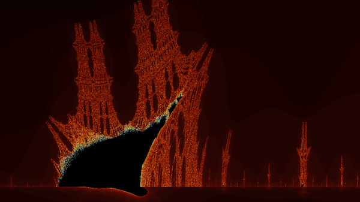

# Fractal Creator

This is my capstone project in the [Udacity C++ Nanodegree Program](https://www.udacity.com/course/c-plus-plus-nanodegree--nd213).

The program calculates and displays fractals and allows exploring them interactively.
It is designed to be easily extendable by adding other types of fractals that feature different recurrence formulas.
Currently, it displays the Mandelbrot set (in the picture above), as well as the "burning ship" fractal.

## Running locally

### Dependencies

- cmake >= 3.7
  - All OSes: [click here for installation instructions](https://cmake.org/install/)
- make >= 4.1 (Linux, Mac), 3.81 (Windows)
  - Linux: make is installed by default on most Linux distros
  - Mac: [install Xcode command line tools to get make](https://developer.apple.com/xcode/features/)
  - Windows: [Click here for installation instructions](http://gnuwin32.sourceforge.net/packages/make.htm)
- SDL2 >= 2.0
  - All installation instructions can be found [here](https://wiki.libsdl.org/Installation).
  - Note that for Linux, an apt or apt-get installation is preferred to building from source.
- gcc/g++ >= 5.4
  - Linux: gcc / g++ is installed by default on most Linux distros
  - Mac: same deal as make - [install Xcode command line tools](https://developer.apple.com/xcode/features/)
  - Windows: recommend using [MinGW](http://www.mingw.org/)

### Building

1. Clone this repo.
2. Make a build directory in the top level directory: `mkdir build && cd build`
3. Compile: `cmake .. && make`
4. Run it: `./FractalCreator`.

### Using

1. In the terminal, enter one of the two predefined fractal types (`M` or `B`).
2. In the opened window, use arrow keys (or WASD) to navigate the fractal, `+` or `-` to zoom in or out.
   Press `Esc` or close the window to exit the program.

## Project structure

The project has the following classes:

1. [Renderer](include/Renderer.h) is a wrapper of the SDL2's renderer that is responsible for updating the screen
   with newly calculated
   pixels. It holds pointers to SDL2's own objects (window, texture, the original renderer), as well as a pointer to
   the beginning of a pixels array that new pixels need to be copied to (required by SDL2).
2. [Controller](include/Controller.h) is responsible for moving the zoom area based on the user's input (arrows/WASD
   and `+`/`-` keys). It does that by having access to a Fractal object (see below).
3. [Creator](include/Creator.h) is a class that calculates RGB values for every pixel on the screen. It has access
   to a Fractal instance that provides it with the mathematical formulas. The RGB values are calculated based on the
   number of iterations that are needed to escape a certain radius in the complex space for a given X, Y point. Creator populates a vector of `std::future`s for each row of pixels and then unwraps them into a uni-dimensional
   vector of RGB chars in asynchronous manner. This vector is then moved to Renderer that copies the pixels into its
   allocated space (SDL2 requirement).
4. [Fractal](include/Fractal.h) is an abstract class that defined a few pure virtual methods that are required for new
   fractal types (the actual formula, the initial zoom area that fits the whole fractal, as well as the fractal's
   user-friendly name).
   Fractal implements the common methods itself (iterative calculations, converting values to RGB).
   The project specifies two subtypes of Fractal ([MandelbrotSet](include/MandelbrotSet.h), [BurningShip](include/BurningShip.h)), but more
   can be added.
5. [Area](include/Area.h) is a helper class that allows manipulating screen areas (mostly used by Controller).

There is also a [utils](include/utils.h) namespace that contains an RGB struct and a helper function to format doubles in
order to show them in the window title.

The [main.cpp](src/main.cpp) logic is responsible for parsing the user input, as well as maintaining the event cycle.

## Specifications met in the project

1. A README with instructions is included with the project.
2. The submission compiles and runs.
3. Loops, functions, IO
   1. The project demonstrates an understanding of C++ functions and control structures (e.g. see main.cpp)
   2. The project accepts user input and processes the input (user is asked what type of fractal they would like to
      explore).
4. OOP
   1. The project uses Object Oriented Programming techniques (see the description of classes above).
   2. Class constructors utilize member initialization lists.
   3. Classes encapsulate behavior (private class attributes are accessible only through getters/setters throughout the
      code).
   4. Classes follow an appropriate inheritance hierarchy (there is composition in Creator that _has_ Fractal
      formulas, and inheritance in MandelbrotSet/BurningShip that _are_ Fractal).
   5. Derived class functions override virtual base class functions (each individual fractal type (MandelbrotSet
      /BurningShip) override the calculateRecurrence method).
5. Memory Management
   1. The project makes use of references in function declarations (e.g. setters accept references,
      `void Renderer::render(std ::vector<unsignedchar> &Pixels)` passes `Pixels` by reference).
   2. The project uses smart pointers instead of raw pointers (e.g. both Controller and Creator use the same
      `shared_pointer` to a Fractal).
6. Concurrency
   1. The project uses multithreading (via `async` and `future`).
